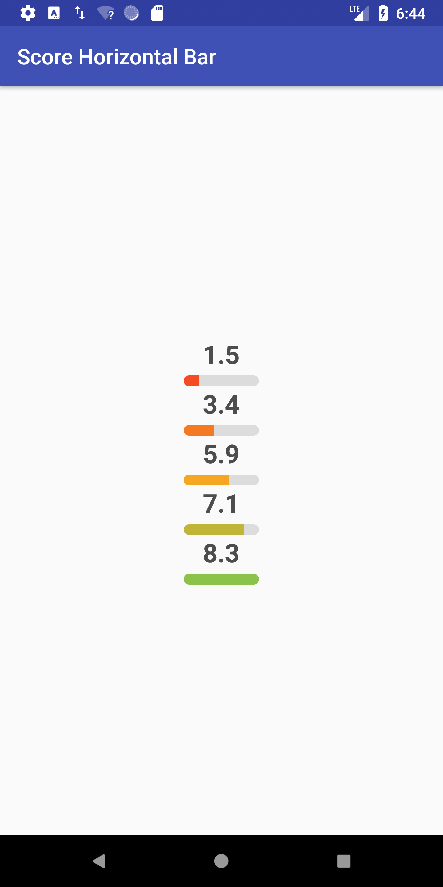

# Score Horizontal Bar

[ ](https://bintray.com/smassive/maven/scorehorizontalbar/_latestVersion)

Just a simple view to show a score with a colored bar

# Screenshot



## Usage

Just add the view to your layout:

```xml
<com.smassive.scorehorizontalbar.ScoreHorizontalBar
      android:id="@+id/scoreHorizontalBar"
      android:layout_height="wrap_content"
      android:layout_width="wrap_content"
      />
```

And then inflate it on your Activity or Fragment and render the score:

```kotlin
scoreHorizontalBar.render(1.5F)
```

## Download

```groovy
dependencies{
    implementation 'com.smassive:scorehorizontalbar:1.0.0'
}
```

## License

```
Copyright 2018 Sergi Castillo


Licensed under the Apache License, Version 2.0 (the "License");
you may not use this file except in compliance with the License.
You may obtain a copy of the License at

   http://www.apache.org/licenses/LICENSE-2.0

Unless required by applicable law or agreed to in writing, software
distributed under the License is distributed on an "AS IS" BASIS,
WITHOUT WARRANTIES OR CONDITIONS OF ANY KIND, either express or implied.
See the License for the specific language governing permissions and
limitations under the License.
```